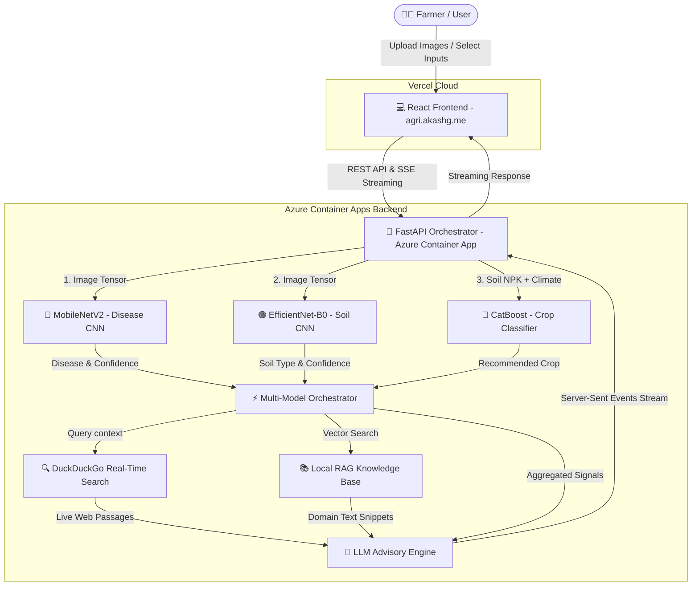
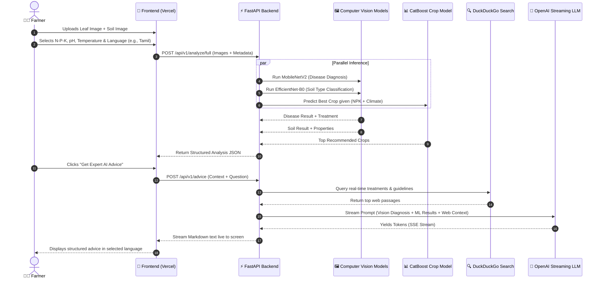

# 🌿 AgroSense AI (Terra·AI) — Project Overview & Architecture Guide

> **Live Application**: [https://agri.akashg.me](https://agri.akashg.me)  
> **Backend API**: Azure Container Apps (FastAPI + PyTorch + Scikit-Learn + OpenAI LLM)  
> **Frontend**: Vercel (React + Vite + TailwindCSS + TanStack Router)

---

## 📌 Executive Summary

**AgroSense AI** is an end-to-end, multi-model Agricultural Intelligence System designed to empower farmers and agronomists with instant diagnostic insights and actionable advice. 

Instead of relying on a single AI model, AgroSense combines:
1. **Computer Vision (CNNs)** for Plant Disease & Soil Type detection.
2. **Machine Learning (CatBoost)** for N-P-K & Weather-based Crop Recommendation.
3. **Real-time Web Search (DuckDuckGo)** for fresh agricultural insights.
4. **Retrieval-Augmented Generation (RAG + LLM)** for streaming, expert advisory in **4 languages** (*English, Tamil, Hindi, Telugu*).

---

## 🏗 System Architecture Diagram

---

## 🔄 End-to-End Request Workflow

---

## 🧩 Core Component Breakdown

### 1. Computer Vision Models
* **Plant Disease Classifier**:
  * **Backbone**: `MobileNetV2` (FP16 quantized for high-speed inference).
  * **Capabilities**: Detects 38 disease categories across major crops (Tomatoes, Potatoes, Corn, Apple, etc.).
* **Soil Type Classifier**:
  * **Backbone**: `EfficientNet-B0`.
  * **Capabilities**: Classifies 4 primary soil types (*Alluvial, Black, Clay, Red*).

---

## ❓ Model Selection Justification (Interview / Defense Q&A)

If evaluators ask: *"Why did you choose MobileNetV2 and EfficientNet-B0 instead of larger models like ResNet-50 or ViT?"* — here are your exact technical justifications:

### 1. 🦠 Why MobileNetV2 for Plant Disease Detection?
* **Depthwise Separable Convolutions**: MobileNetV2 splits standard convolution into depthwise and pointwise operations. This reduces parameters by **~80%** (3.4M params vs 25M+ in ResNet-50) with almost zero loss in accuracy.
* **Inverted Residuals & Linear Bottlenecks**: Maintains high-frequency spatial features (small leaf spots, rust lesions, powdery mildew textures) even in low-dimensional representations.
* **Low Latency & Low Memory**: Ideal for CPU-bound cloud containers (Azure) or future offline mobile edge deployment in rural farms with limited internet connectivity.

### 2. 🟤 Why EfficientNet-B0 for Soil Type Classification?
* **Principle of Compound Scaling**: EfficientNet uniformly scales depth, width, and image resolution together using a mathematical compound coefficient.
* **Granular Soil Texture Feature Extraction**: Soil identification relies heavily on micro-textures (grain size, color gradients, moisture reflection). EfficientNet’s MBConv blocks capture these multi-scale visual textures better than traditional CNNs.
* **SOTA Accuracy-to-Parameter Ratio**: Delivers accuracy higher than ResNet-50 while requiring **5x fewer parameters** (~5.3M params) and executing in ~30ms on standard CPUs.

### 3. 🌾 Why CatBoost for Crop Recommendation?
* **Superior Tabular Data Performance**: Gradient Boosted Decision Trees (GBDTs) consistently outperform Deep Neural Networks on tabular tabular environmental features (N, P, K, pH, rainfall, temp).
* **Robust Against Overfitting**: CatBoost uses symmetric trees and ordered boosting, preventing target leakage and overfitting on agricultural tabular data.

---

### 2. Crop Recommendation Classifier
* **Algorithm**: `CatBoost` gradient-boosted decision trees.
* **Input Parameters**: Nitrogen (N), Phosphorus (P), Potassium (K), Temperature, Humidity, pH, Rainfall.
* **Output**: Ranks top crops out of 22 supported agricultural crop varieties.

### 3. Real-Time Search & RAG Context Engine
* **DuckDuckGo Real-Time Search**: Dynamically fetches recent agricultural advisories, pest outbreak news, and local treatment options.
* **FAISS Vector RAG Knowledge Base**: Indexes specialized domain `.txt` documents for verified localized treatments.

### 4. Multilingual LLM Advisory Engine
* **Streaming Protocol**: Server-Sent Events (`text/event-stream`).
* **Multilingual Translation**: Seamless prompt engineering for localized outputs in **English, Tamil (தமிழ்), Hindi (हिंदी), and Telugu (తెలుగు)**.

---

## 🎤 Quick Demo Pitch Script (How to Explain in 60 Seconds)

> *"Hi! Today I'm presenting **AgroSense AI**, an intelligent agricultural assistant built for modern farming."*
>
> 1. *"First, a farmer takes a photo of a sick plant leaf or soil. Our computer vision models—MobileNetV2 and EfficientNet—instantly diagnose crop diseases and identify soil composition."*
> 2. *"Next, our ML model analyzes soil N-P-K levels and weather patterns to recommend the highest-yielding crops."*
> 3. *"Finally, our system fetches real-time web insights and passes the entire diagnostic context into a streaming AI advisory engine. It delivers clear, step-by-step guidance directly to the farmer in their native language—whether English, Tamil, Hindi, or Telugu."*
> 4. *"Everything is deployed live: the React frontend runs on Vercel at `agri.akashg.me`, and the backend runs on Azure Container Apps with automated Docker CI/CD."*

---

## 🛠 Tech Stack Summary

| Layer | Technology |
|---|---|
| **Frontend UI** | React 18, Vite, TailwindCSS, Lucide Icons, TanStack Router |
| **Backend API** | Python 3.10, FastAPI, Uvicorn, AsyncIO, SlowAPI (Rate Limiting) |
| **Machine Learning** | PyTorch (MobileNetV2, EfficientNet-B0), Scikit-Learn, CatBoost |
| **Generative AI** | OpenAI-compatible LLM API, DuckDuckGo Search Integration |
| **Cloud & DevOps** | Azure Container Apps, Vercel, Docker, GitHub Actions CI/CD |
